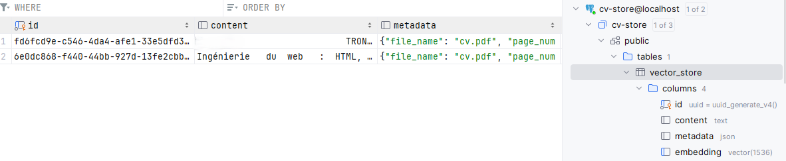
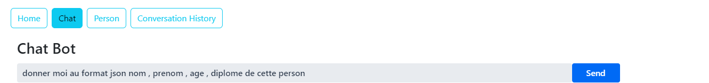

## Développement d'un Chat Boot RAG Spring React 
-------------------------------------------------------------------------------------------------------------------------------------------------------

Ce projet est une application web fullstack utilisant Spring et React pour mettre en œuvre un Chat Bot basé sur un système RAG (Retrieval-Augmented Generation) 
avec les LLMs (Large Language Models) Llama3 et OpenAI. 
L'application utilise Spring AI côté backend et React côté frontend en utilisant VAADIN pour l'interface utilisateur.

## Architecture

<h2>L'application est divisée en deux parties principales : </h2>

1. **Backend** :
   - Intégration avec les modèles Llama3 et OpenAI pour le traitement du langage naturel.
   - Utilisation de pgvector pour la sauvegarde de store dans une base de donné postgre sql.
 

2. **Frontend** :
   - Utilisation de React pour construire une interface utilisateur réactive et moderne.
   - Utilisation de VAADIN pour les composants d'interface utilisateur.

## Table vector Store 

  
## Page de chat 

un autre exemple 

Add new person

show list of person

edit person 

Delete person 

